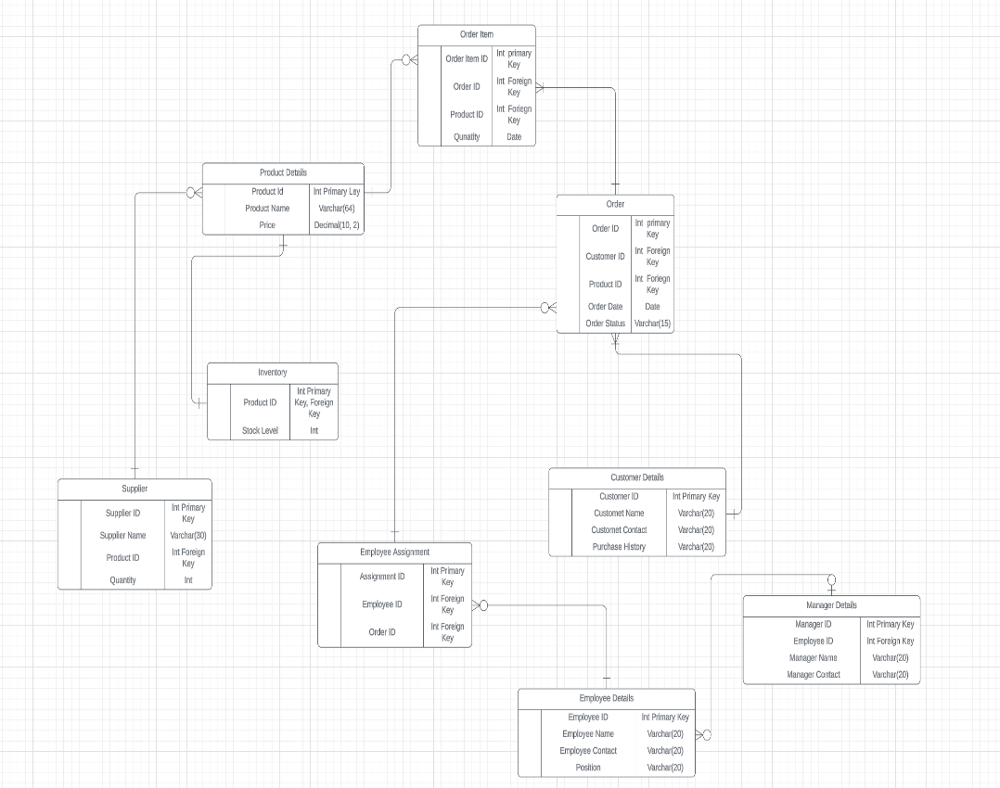
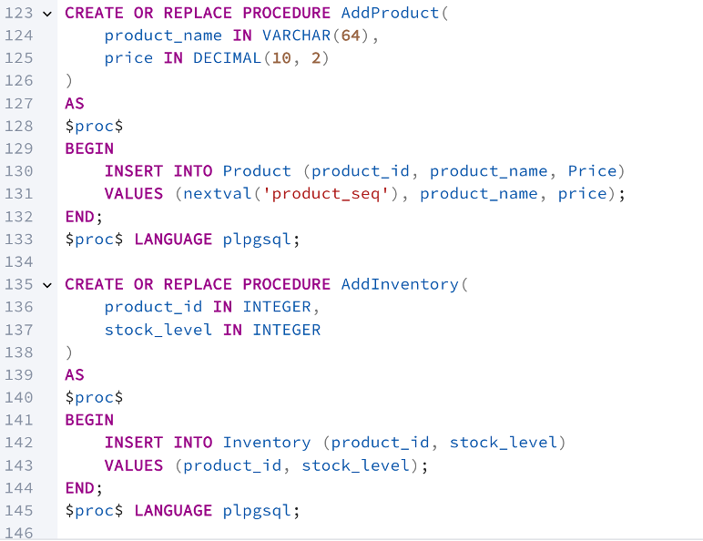
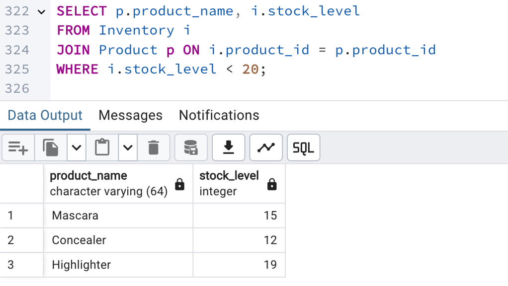
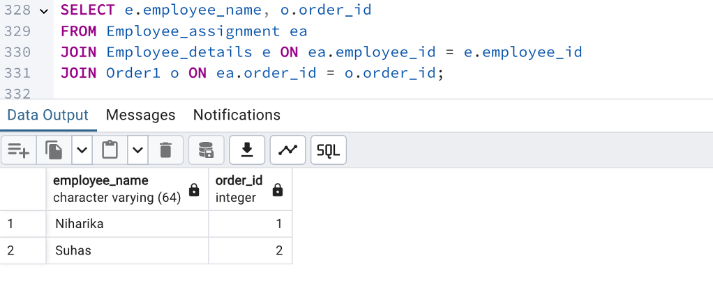
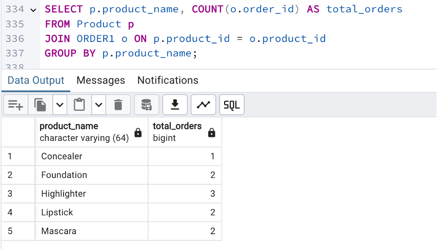
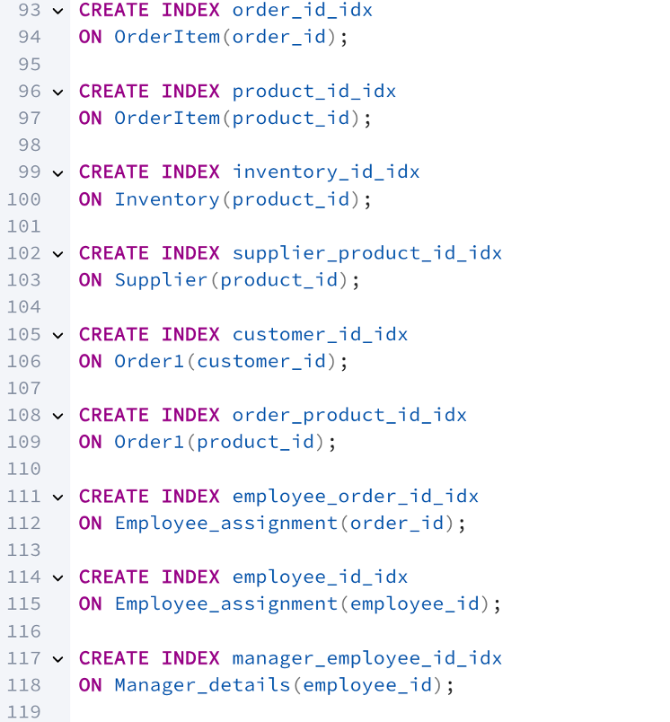
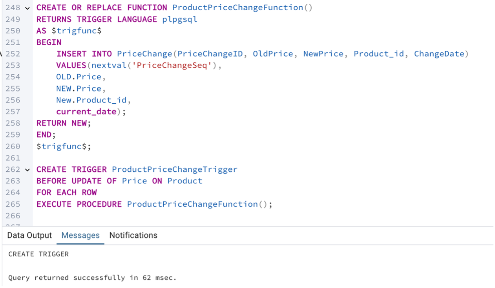

# Online Makeup Store Database

This project involves the complete design and implementation of a database management system (DBMS) for an online makeup retail store. The database manages products, inventory levels, order records, customer information, employee assignments, and manager oversight.

## Project Overview:
* Designed a full relational database schema with an Entity-Relationship Diagram (ERD).
* Implemented structural rules, foreign key relationships, and normalization techniques.
* Automated data operations using stored procedures, analytical queries, triggers, and indexing for optimization.
* Set up a history table and trigger to track price changes over time.

## Entity-Relationship Diagram:
The ERD below outlines the database structure and relationships between tables.

## Stored Procedures: 

Reusable stored procedures were created to automate common tasks, such as inserting new products and other entities into the database.
* Example: Adding a new product using AddProduct stored procedure.

## Analytical Queries: 
Several analytical queries were developed to monitor inventory, employee assignments, and product popularity:
* Products with Inventory Level Below 20
Helps identify low-stock items that need reordering.

* Employee Assigned to Each Order
Tracks which employee is handling each order.

* Total Orders by Product
Displays product popularity based on order counts.

## Indexing
Indexes were created on frequently queried columns to improve database performance and speed up retrieval times.

## History Table and Triggers
A history table was implemented along with a trigger to automatically log price changes for products. This ensures full auditability of pricing over time.

## Tools Used:
- MySQL
- SQL Stored Procedures
- Indexing and Triggers
- Entity-Relationship Diagrams (ERD)

## Use Cases Covered:
- Inventory Management
- Customer Orders and Assignment Tracking
- Employee and Manager Relationship Management
- Product Availability Monitoring

## Summary:
This project strengthens operational efficiency by automating core processes such as stock management, employee assignments, and customer orders, while maintaining robust auditability through history tracking and indexing.
